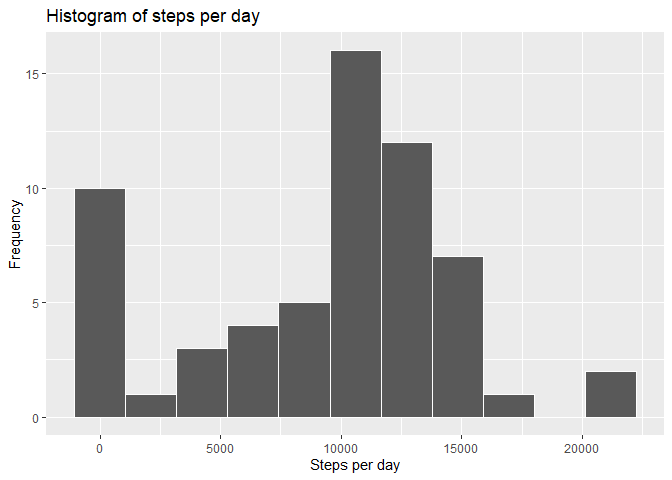
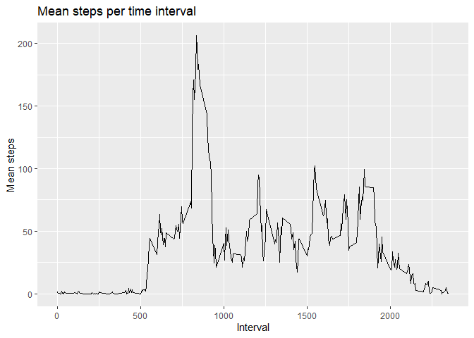
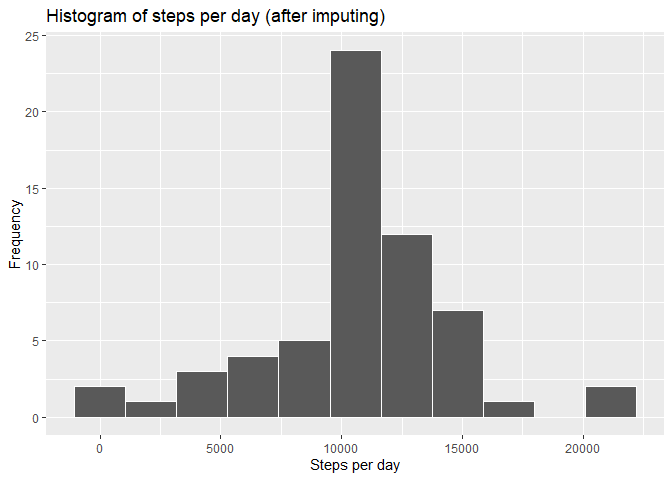
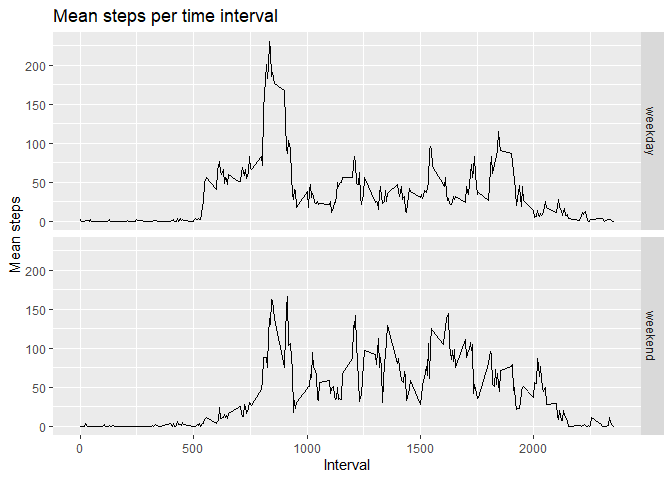

### Prerequsits

Loading packages

``` r
library(dplyr)
library(ggplot2)
```

### Reading data

``` r
data <- read.csv("activity.csv")
```

### Generate Histogram of data

``` r
steps_per_day <- data %>%
    group_by(date) %>%
    summarise(sum = sum(steps, na.rm = TRUE))

ggplot(steps_per_day, aes(x = sum)) +
    geom_histogram(bins = 11,
                   col = "white") +
    labs(title = "Histogram of steps per day",
         x = "Steps per day",
         y = "Frequency")
```



### Calculate the mean and median of steps taken each day

``` r
mean <- mean(steps_per_day$sum, na.rm = TRUE)
median <- median(steps_per_day$sum, na.rm = TRUE)
```

The mean value is 9354.23 steps per day.

The median value is 10395 steps per day.

### Time series plot

``` r
avg_int <- data %>%
    group_by(interval) %>%
    summarise(mean = mean(steps, na.rm = TRUE))

ggplot(avg_int, aes(x = interval, y = mean)) +
    geom_line() +
    labs(title = "Mean steps per time interval",
         x = "Interval",
         y = "Mean steps")
```



``` r
max_steps_interval <- avg_int$interval[avg_int$mean == max(avg_int$mean)]
```

The 5-minute time interval with the most steps (on average) is \#835.

### Imputing

An easy way for imputing missing values in the dataset is by replacing
NA values with the average value for the specific time intervall. If we
look at the given dataset, there is a total of 17568 entries in the
steps column of which 2304 are missing values.

Now we replace the missing values by the interval-average

``` r
missing <- is.na(data$steps)
for(i in seq(1, length(data$steps))) {
    if (missing[i])
        data$steps[i] <- avg_int$mean[avg_int$interval==data$interval[i]]
}
```

Now the number of entries is still 17568, but the number of NAs is
reduced to 0. We replot the histogram from before with the imputed
dataset:

``` r
steps_per_day <- data %>%
    group_by(date) %>%
    summarise(sum = sum(steps, na.rm = TRUE))

ggplot(steps_per_day, aes(x = sum)) +
    geom_histogram(bins = 11,
                   col = "white") +
    labs(title = "Histogram of steps per day (after imputing)",
         x = "Steps per day",
         y = "Frequency")
```



### Panel Plot of weekdays vs weekend

Make a new column for the name of the day

``` r
data_with_name <- data %>%
    mutate(weekday = as.factor(weekdays(as.Date(date))))
levels(data_with_name$weekday) <- list("weekday" = c("Montag", "Dienstag", "Mittwoch", "Donnerstag", "Freitag"),
                                       "weekend" = c("Samstag", "Sonntag"))
```

Group the data

``` r
avg_int_weekday <- data_with_name %>%
    group_by(interval, weekday) %>%
    summarise(mean = mean(steps))
```

Plot the data

``` r
ggplot(avg_int_weekday, aes(x = interval, y = mean)) +
    geom_line() +
    facet_grid(weekday~.) +
    labs(title = "Mean steps per time interval",
         x =  "Interval",
         y = "Mean steps")
```


